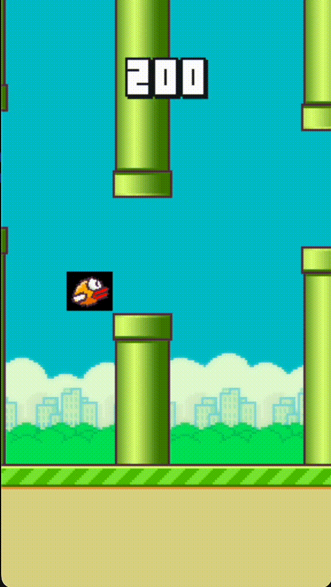

<div align="center">

# Flappy Bird Deep Q-Network (DQN) Reinforcement Learning

[](https://python.org)
[](https://pytorch.org)
[](https://gymnasium.farama.org/)
[](#)
[](https://jupyter.org)

> A Deep Reinforcement Learning project implementing a **Deep Q-Network (DQN)** agent that learns to play Flappy Bird using Gymnasium and PyTorch.

</div>

---

# 🎯 Project Overview

This project demonstrates how a Deep Q-Network (DQN) can learn to play the classic **Flappy Bird** game without any human guidance.

Instead of being programmed with rules, the agent learns by interacting with the environment, receiving rewards, and gradually improving its decisions over time.

The agent was trained for **135,000 episodes**, eventually learning to survive for long durations and successfully pass multiple pipes.

This project demonstrates the complete Deep Reinforcement Learning pipeline including:

- Environment interaction
- Deep Q-Network (DQN)
- Experience Replay
- Target Network
- ε-Greedy Exploration
- Neural Network Optimization
- Policy Learning
- Model Saving

---

# 🎮 Agent Gameplay





The GIF above demonstrates the trained DQN agent after **135,000 training episodes**, successfully navigating through multiple pipes.

---

# 🤖 What is Deep Reinforcement Learning?

Deep Reinforcement Learning combines **Reinforcement Learning** with **Deep Neural Networks**.

Instead of storing values inside a Q-table, a neural network is trained to approximate Q-values.

This enables the agent to solve much larger and more complex environments where traditional Q-learning becomes impractical.

The learning process consists of:

- Agent
- Environment
- State
- Action
- Reward
- Policy
- Neural Network

---

# 🧠 What is Deep Q-Network (DQN)?

Deep Q-Network (DQN) is an extension of the traditional Q-Learning algorithm.

Instead of maintaining a lookup table, DQN uses a neural network to estimate the Q-value for every possible action.

To improve learning stability, DQN introduces two important concepts:

- Experience Replay
- Target Network

These techniques significantly improve convergence and reduce unstable learning.

---

# 🕹️ Flappy Bird Environment

The environment is based on the Gymnasium implementation of Flappy Bird.

The objective is simple:

- Keep the bird flying.
- Avoid hitting pipes.
- Avoid hitting the ground.
- Pass as many pipes as possible.

The agent receives rewards while surviving and learns an effective policy through repeated interaction.

---

# 🚀 Features

- Deep Reinforcement Learning
- Deep Q-Network (DQN)
- PyTorch Implementation
- Experience Replay Memory
- Target Network Synchronization
- ε-Greedy Exploration Strategy
- Automatic Model Saving
- Flappy Bird Gymnasium Environment
- GPU Support (CUDA / Apple MPS)
- Interactive Gameplay Rendering

---

# 🧠 Learning Pipeline

## Environment Setup

- Create Flappy Bird Gymnasium environment
- Initialize DQN model
- Initialize Target Network
- Initialize Replay Memory

## Exploration

- Random exploration using ε-Greedy policy
- Greedy exploitation using learned Q-values

## Experience Collection

- Observe current state
- Select action
- Receive reward
- Observe next state
- Store experience inside Replay Buffer

## Model Training

- Sample mini-batches
- Compute target Q-values
- Compute loss
- Backpropagation
- Update policy network

## Policy Improvement

- Synchronize target network
- Decay exploration rate
- Save best-performing model

---

# 🏗️ Deep Q-Network Architecture

```text
Environment State (12 Features)

          ↓

Input Layer

          ↓

Fully Connected Layer
(256 Neurons)

          ↓

ReLU Activation

          ↓

Output Layer
(2 Actions)

          ↓

Q-Values
```

---

# 📚 Experience Replay

Experience Replay stores previous experiences inside a replay buffer.

Each experience consists of:

- Current State
- Action
- Reward
- Next State
- Done Flag

Instead of learning from consecutive experiences, the model randomly samples mini-batches from memory.

Benefits:

- Breaks correlation between experiences
- Improves stability
- Better convergence
- Efficient learning

---

# 🎯 Target Network

A separate Target Network is maintained to stabilize learning.

Instead of updating target values every step, the Target Network is synchronized periodically with the Policy Network.

Benefits:

- Stable Q-value estimation
- Reduced oscillations
- Faster convergence

---

# ⚙️ Model Hyperparameters

| Parameter | Value |
|-----------|--------|
| Algorithm | Deep Q-Network (DQN) |
| Framework | PyTorch |
| Environment | FlappyBird-v0 |
| Episodes Trained | **135,000** |
| Optimizer | Adam |
| Loss Function | Mean Squared Error (MSE) |
| Exploration Policy | ε-Greedy |
| Replay Memory | Enabled |
| Target Network | Enabled |
| Device Support | CPU / CUDA / Apple MPS |

---

# 📈 Training Results

The DQN agent was successfully trained for **135,000 episodes**.

During training, the agent gradually improved its policy by balancing exploration and exploitation.

The final trained model was capable of:

- Passing multiple consecutive pipes
- Avoiding collisions with obstacles
- Learning stable gameplay behavior
- Improving survival time significantly
- Saving the best-performing model automatically

# 📂 Project Structure

```text
Flappy-Bird-DQN-Reinforcement-Learning/
│
├── images/
│   └── gameplay.gif
│
├── runs/
│   ├── flappybirdv0.pt
│   └── flappybirdv0.log
│
├── agent.py
├── dqn.py
├── experience_replay.py
├── game_flappy_bird.py
├── parameters.yaml
├── requirements.txt
├── .gitignore
└── README.md
```

---

# 🖥️ Run Locally

### 1. Clone the Repository

```bash
git clone https://github.com/harsh-v16/Flappy-Bird-DQN-Reinforcement-Learning.git

cd Flappy-Bird-DQN-Reinforcement-Learning
```

---

### 2. Install Dependencies

```bash
pip install -r requirements.txt
```

---

### 3. Train the Agent

```bash
python agent.py flappybirdv0 --train
```

---

### 4. Test the Trained Agent

```bash
python agent.py flappybirdv0
```

The trained model stored inside the **runs/** directory will automatically be loaded for evaluation.

---

# 📦 Requirements

Create a `requirements.txt` file containing:

```text
torch
gymnasium
flappy-bird-gymnasium
pygame
numpy
pyyaml
matplotlib
jupyter
```

---

# 📄 .gitignore

```gitignore
# Python Cache
__pycache__/
*.py[cod]

# Jupyter
.ipynb_checkpoints/

# Virtual Environment
venv/
env/
.venv/

# VS Code
.vscode/

# Operating System
Thumbs.db
.DS_Store
```

---

# 🛠️ Tech Stack

| Tool | Purpose |
|------|----------|
| Python | Programming Language |
| PyTorch | Deep Learning Framework |
| Gymnasium | Reinforcement Learning Environment |
| NumPy | Numerical Computation |
| PyGame | Game Rendering |
| YAML | Hyperparameter Configuration |
| Jupyter Notebook | Development Environment |
| GitHub | Version Control |

---

# 📚 Learning Outcomes

Through this project, I learned:

- Fundamentals of Deep Reinforcement Learning
- Deep Q-Network (DQN) Algorithm
- Experience Replay Buffer
- Target Network Synchronization
- ε-Greedy Exploration Strategy
- Neural Network-Based Q-Value Approximation
- Hyperparameter Tuning
- Model Checkpoint Saving
- Training AI Agents through Trial and Error
- Solving Sequential Decision-Making Problems
- Working with Gymnasium Environments
- Building Reinforcement Learning Projects using PyTorch

---

# 🎯 Key Concepts Demonstrated

- Reinforcement Learning
- Deep Reinforcement Learning
- Deep Q-Network (DQN)
- Experience Replay
- Target Network
- ε-Greedy Exploration
- Bellman Equation
- Neural Network Optimization
- Policy Learning
- Sequential Decision Making

---

# 🔮 Future Improvements

- Double Deep Q-Network (Double DQN)
- Dueling DQN Architecture
- Prioritized Experience Replay
- Rainbow DQN
- Hyperparameter Optimization
- TensorBoard Training Visualization
- Reward Curve Visualization
- Model Performance Dashboard
- Deployment as an Interactive Web Application

---

# 📸 Results

After training the agent for **135,000 episodes**, the Deep Q-Network successfully learned an effective policy for playing Flappy Bird.

The trained agent is capable of:

- Flying through multiple consecutive pipes
- Avoiding collisions consistently
- Selecting actions based on learned Q-values
- Demonstrating stable gameplay behavior

The gameplay GIF included in this repository showcases the trained agent's performance.

---

# 🤝 Contributing

Contributions, suggestions, and improvements are always welcome.

If you would like to improve this implementation or experiment with advanced Deep Reinforcement Learning algorithms, feel free to fork the repository and submit a pull request.

---

# 👤 Author

<div align="center">

**Harsh Chaudhary**

Computer Engineering Student | Machine Learning & Deep Learning Enthusiast

[](https://github.com/harsh-v16)

[](https://www.linkedin.com/in/harsh-chaudhary-6ba5b8395/)

</div>

---

<div align="center">

⭐ If you found this project useful, consider giving it a star!

</div>

The project demonstrates how Deep Reinforcement Learning can solve sequential decision-making problems using neural networks instead of traditional Q-tables.

---
